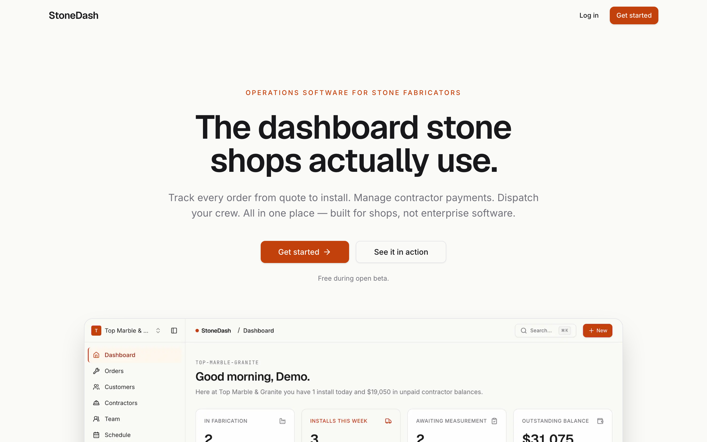
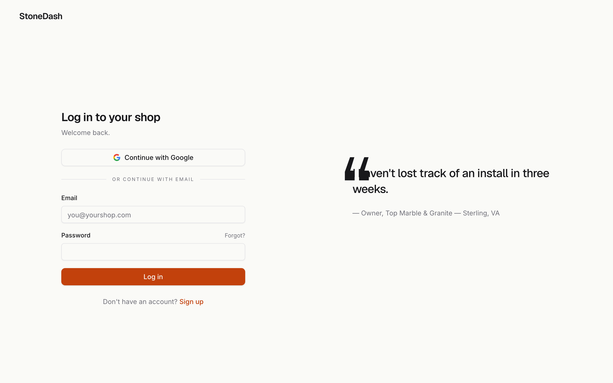
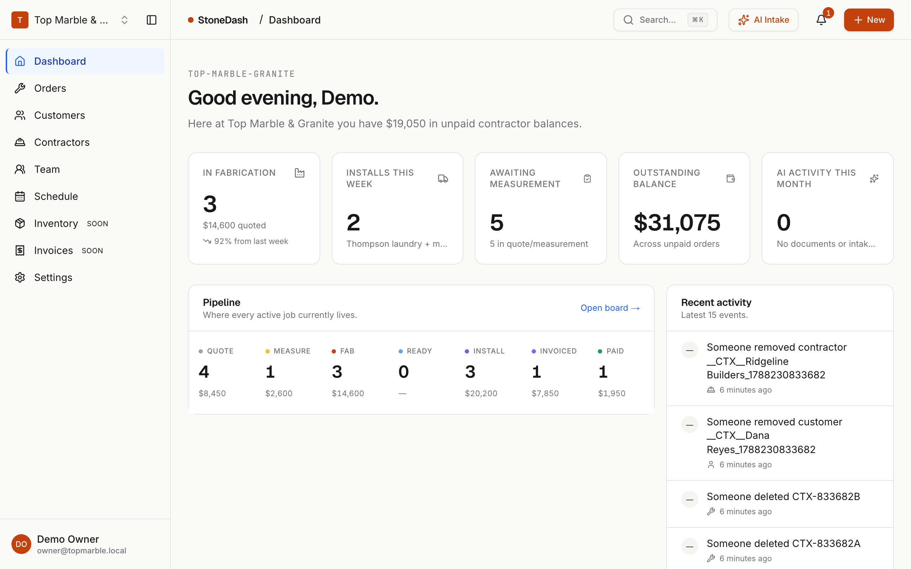
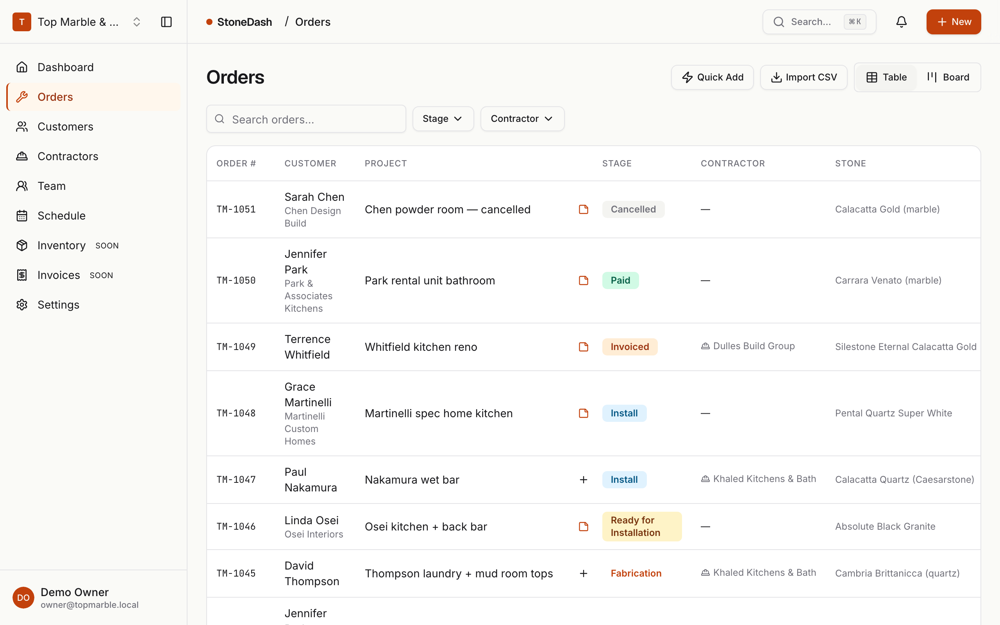
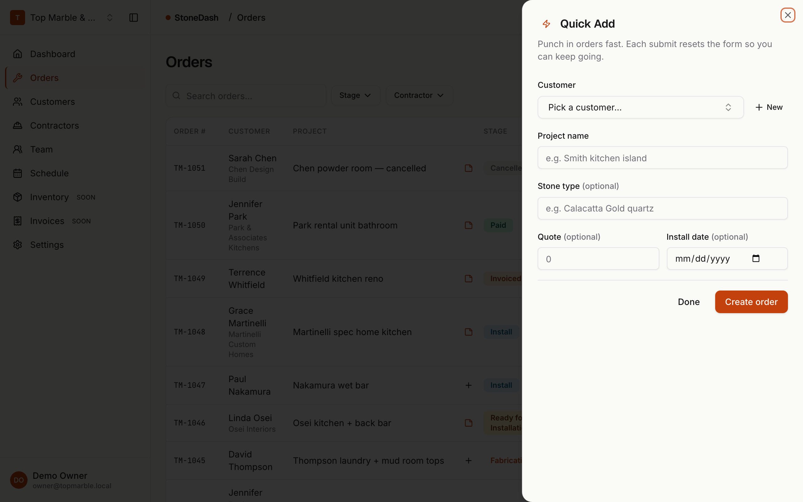

# StoneDash

**The dashboard stone shops actually use.**

Operations platform for stone, marble, granite, and quartz fabrication
shops. Multi-tenant SaaS built with Next.js 14 (App Router), Supabase
(Auth + Postgres + Storage + RLS), Prisma for types, shadcn/ui, Zod,
react-hook-form, @dnd-kit, and nuqs.

---

## Screenshots

Live captures of the current UI. Regenerate with
`pnpm tsx --env-file=.env.local scripts/capture_docs_screenshots.ts`
against a running `pnpm dev` server.

| Surface | Preview |
|---|---|
| Public landing — `/` |  |
| Auth — `/login` |  |
| Dashboard |  |
| Orders list |  |
| Quick Add — `/orders?quick=1` |  |

---

## Prerequisites

- **Node.js 20+** (tested on 24.10)
- **pnpm 10+** (`npm install -g pnpm`)
- **Git**
- **Supabase CLI** — for applying migrations to the hosted project:
  ```sh
  brew install supabase/tap/supabase    # macOS
  # or: npm install -g supabase           # any OS
  ```
- A **hosted Supabase project** at <https://supabase.com/dashboard>.
  Free tier is fine.

---

## Getting started

### 1. Install dependencies

```sh
pnpm install
```

`postinstall` runs `prisma generate`, so the Prisma client is ready
before the first `pnpm dev`.

Install the migration-drift guard: `cp scripts/hooks/commit-msg .git/hooks/commit-msg && chmod +x .git/hooks/commit-msg`

### 2. Create a Supabase project

1. Visit <https://supabase.com/dashboard> → **New project**.
2. Pick a region close to your shop. Note the database password.
3. Wait ~2 minutes for provisioning.

### 3. Configure env vars

```sh
cp .env.example .env.local
```

Fill `.env.local` using values from the Supabase dashboard:

| Variable | Where to get it |
|---|---|
| `NEXT_PUBLIC_SUPABASE_URL` | Project Settings → API → Project URL |
| `NEXT_PUBLIC_SUPABASE_ANON_KEY` | Project Settings → API → `anon` public key |
| `SUPABASE_SERVICE_ROLE_KEY` | Project Settings → API → `service_role` (keep secret) |
| `DATABASE_URL` | Project Settings → Database → Connection string → **URI** (port 5432 direct) |
| `NEXT_PUBLIC_SITE_URL` | `http://localhost:3000` in dev; your Vercel URL in prod |
| `SUPABASE_PROJECT_REF` | The subdomain of your project URL, e.g. `abcdefg` |

> **Never commit `.env.local`.** `.gitignore` already excludes it.

### 4. Apply migrations + seed

Link the Supabase CLI to your project once:

```sh
supabase link --project-ref "$SUPABASE_PROJECT_REF"
```

Then:

```sh
pnpm db:migrate   # applies /supabase/migrations/*.sql in order
pnpm db:seed      # creates demo org + 10 orders (idempotent)
```

The seed creates:

- Two demo logins:
  - Owner: `owner@topmarble.local` / `StoneDemo!2026`
  - Field tech: `field@topmarble.local` / `StoneDemo!2026` (use this to try
    the app as an installer — read-only on most surfaces, can mark event
    status only)
- Shop: `Top Marble & Granite` (slug `top-marble-granite`,
  order prefix `TM`, starting at `TM-1042`)
- 8 customers, 10 orders across every stage
- 3 contractors with distinct payment-terms shapes (Running tab / Net 30 /
  Net 60), 5 of the 10 orders tagged, 2 payments split across allocations
  so the contractor detail page has real balances to render
- 5 crew members across the four shop roles (lead installer, helper,
  fabricator, measurement tech); next 3 upcoming installs assigned to
  Carlos + Jorge, one more to Mike + David, rest unassigned
- 2 event share links (one live, one revoked) so the smoke matrix at
  `/j/[slug]` has both resolution cases available

### 5. Enable Google OAuth (optional)

The app's login/signup screens include a **Continue with Google** button
but it will 500 until you enable the provider:

1. Create OAuth credentials at <https://console.cloud.google.com/apis/credentials>.
   Authorized redirect URI: `https://<project-ref>.supabase.co/auth/v1/callback`.
2. In Supabase: **Authentication → Providers → Google** → paste client ID
   + secret → Save.

Email+password works out of the box.

### 6. Run

```sh
pnpm dev
```

Open <http://localhost:3000>. Sign in with the demo credentials, or
sign up a fresh account and run through `/onboarding`.

---

## Scripts

| Script | Purpose |
|---|---|
| `pnpm dev` | Next dev server. |
| `pnpm build` | Production build. Same bundler Vercel uses. |
| `pnpm start` | Runs the production build. |
| `pnpm lint` | Next lint with `--max-warnings 0` (ESLint runs in CI mode). |
| `pnpm typecheck` | `tsc --noEmit`. Strict mode + `noUncheckedIndexedAccess`. |
| `pnpm db:migrate` | `supabase db push` — pushes `/supabase/migrations/*.sql` to the linked project. |
| `pnpm db:pull` | `prisma db pull` — regenerates `prisma/schema.prisma` from the current DB. Use to check drift. |
| `pnpm db:generate` | `prisma generate` — regenerates the Prisma client. |
| `pnpm db:reset` | `supabase db reset` — DROPs everything and re-runs migrations. Destructive. |
| `pnpm db:seed` | `tsx --env-file=.env.local supabase/seed.ts`. Idempotent. |

---

## Project structure

```
/app
  layout.tsx                       root shell (theme, fonts, nuqs, toaster)
  (marketing)/page.tsx             public landing
  (auth)/login/page.tsx            email+password + Google
  (auth)/signup/page.tsx           creates profile, routes to /onboarding
  (auth)/callback/route.ts         OAuth / magic-link return → /dashboard
  (auth)/logout/route.ts           POST → /
  onboarding/page.tsx              org + owner membership bootstrap
  invite/[token]/page.tsx          accept invite
  (app)/layout.tsx                 sidebar + topbar shell (gated)
  (app)/dashboard/page.tsx         KPIs + pipeline + activity feed
  (app)/orders/page.tsx            table + board + detail sheet + new dialog
  (app)/customers/page.tsx         table + detail sheet + new dialog
  (app)/contractors/page.tsx       list + create + balance view
  (app)/contractors/[id]/page.tsx  header + Jobs / Payments / Details tabs
  (app)/team/page.tsx              crew member list + assignment history
  (app)/schedule/page.tsx          week / day / list views + event dialog
  (app)/settings/page.tsx          Profile / Shop / Members tabs
  j/[slug]/page.tsx                public crew share page (no auth)
/components
  theme-provider.tsx
  ui/                              shadcn primitives
  app/                             app-specific components
/lib
  supabase/server.ts               server (RLS respected)
  supabase/client.ts               browser (RLS respected)
  supabase/middleware.ts           session refresh pipeline
  supabase/admin.ts                service-role (RLS bypassed — server only)
  supabase/types.ts                row types
  auth.ts                          getCurrentUserAndOrg
  rbac.ts                          role hierarchy helpers
  db.ts                            Prisma singleton (service-role only)
  actions/                         server actions
  queries/                         server query helpers
  validators/                      zod schemas
/prisma
  schema.prisma                    TS type mirror of the DB
/supabase
  migrations/0001..0015.sql        DDL + RLS + functions + storage + contractors + scheduling
  seed.ts                          demo data (idempotent)
/middleware.ts                     protects /(app)/**, rate-limits /j/[slug]
```

---

## How-to

### Add a new order stage

1. **Postgres enum** — create a new SQL migration that runs:

   ```sql
   ALTER TYPE order_stage ADD VALUE 'hold' BEFORE 'cancelled';
   ```

   Postgres enum values are append/before/after only — you cannot reorder
   retroactively.

2. **Prisma enum** — add the value to `prisma/schema.prisma`:

   ```prisma
   enum OrderStage {
     quote
     ...
     hold
     cancelled
   }
   ```

   Run `pnpm db:generate`.

3. **UI labels + colors** — extend `components/app/pipeline-strip.tsx`
   (`STAGE_ORDER`, `STAGE_LABELS`) and `components/app/order-stage-badge.tsx`
   (`STAGE_STYLES`).

4. **Board view** — add the stage to `BOARD_STAGES` in
   `components/app/orders-board.tsx` if it should be draggable-to.

### Add a new role

1. **Postgres enum** — `ALTER TYPE member_role ADD VALUE 'accounting' ...`.
2. **RLS policies** — decide what the role can do. The pattern in
   `supabase/migrations/0002_rls.sql` uses `org_role(org_id) IN (...)`
   checks; add the new role to the appropriate policies.
3. **Column-level gates on orders** — if the new role needs narrow write
   permissions (like `field`), extend
   `enforce_field_role_columns()` with a branch.
4. **`lib/rbac.ts`** — add the new role to `LEVEL` and any `can*` helpers
   you want to permit it.
5. **Members UI** — add the role to `ASSIGNABLE_ROLES` in
   `components/app/settings-members.tsx` and the `role` select in the
   invite form.

### Understand the contractor data model

Some customers come in through a general contractor, kitchen-and-bath
dealer, or builder. The shop ends up talking to **both** the homeowner
(measurement, install) and the contractor (billing, referral). Two
relationships, one order.

Three tables + two views make this work:

```
contractors                      one row per GC / dealer / builder
orders.contractor_id             nullable FK, ON DELETE SET NULL
contractor_payments              one row per check / ACH / etc.
contractor_payment_allocations   payment ↔ order, N:M with amount
v_order_contractor_paid          per-order: sum(allocations.amount)
v_contractor_balances            per-contractor: jobs_total, paid, balance
```

The allocation table exists because one $10k check can cover three
kitchens — $4k on A, $3.5k on B, $2.5k on C. Without it you can't tell a
contractor "here's what you still owe on the Springfield kitchen
specifically," and you can't reconcile partial payments.

**Write-path lockdown.** Direct writes to `contractor_payments` and
`contractor_payment_allocations` are blocked three ways: `REVOKE INSERT,
UPDATE, DELETE … FROM authenticated`, RLS `WITH CHECK (false)`, and no
app code that targets them. Everything goes through three RPCs defined
in `0012_contractor_payment_rpc.sql`:

- `record_contractor_payment(...)` — insert payment + allocations atomically.
- `update_contractor_payment(...)` — edit (re-writes allocations in place).
- `delete_contractor_payment(...)` — cascade-delete the allocations.

All three are `SECURITY DEFINER` (to bypass RLS + the REVOKE), do their
own `is_org_member + org_role >= manager` check, and enforce
`sum(alloc.amount) = payment.amount` to 2dp. The audit triggers from
`0011_contractors.sql` fire inside the RPC transaction, so every row is
audited atomically with the mutation.

**Homeowner vs. contractor balances.** `orders.balance_due` is the
homeowner-side figure (`quote_amount - deposit_received`) and is
untouched by this feature. The contractor detail page computes a
**separate** contractor-side balance (`quote_amount - sum(allocations)`).
The two are intentionally not reconciled in Task 2B — a later design pass
needs to add a `bill_to` enum on orders. See the "Billing side
ambiguity" note in `DEVLOG.md` for the deferred work.

**Non-owner RLS check.** `scripts/smoke_contractors_rls.ts` signs in as
a non-member user and asserts (a) the views return zero rows with no
error and (b) direct INSERT into payment tables is rejected. Run it any
time you edit the RLS / REVOKE in `0011_contractors.sql`:

```sh
pnpm tsx --env-file=.env.local scripts/smoke_contractors_rls.ts
```

### Understand the scheduling model

The unit being scheduled is the **JOB EVENT**, not the crew. An order
typically has 1–3 events (a measurement, an install, sometimes a
delivery). Each event has its own date, time, duration, location, and
assigned crew. Crew members are **not** Throughstone users — they're
people you assign work to. Most never log into the app.

```
crew_members                     people you dispatch (not app accounts)
order_events                     measurement / install / delivery / pickup / other / task
order_event_assignments          event ↔ crew, N:M with per-assignment role
event_share_links                public slugs for /j/[slug]
v_calendar_events                joined read-model used by the calendar UI
v_orders_with_event_dates        orders + next install/measurement (derived)
```

**Standalone events and all-day events.** `order_events.order_id` is
nullable: events that aren't tied to a job (a phone call, a payment
pickup, a trade show) carry a `title` instead. The dialog's Type
segmented control toggles between "For an order" and "Standalone"
at create time; the kind is fixed at create per Q3 of Task 3.1.
`order_events.is_all_day` flags events without a specific clock time —
they render in a horizontal strip above the hour grid. The dialog's
"All day" checkbox hides the time + duration pickers when set. The
same-day CHECK constraint exempts all-day events (a 24-hour event
necessarily crosses UTC midnight in any non-UTC org tz); the action
layer enforces 00:00 org-local normalization as the belt-and-suspenders
pair.

**Why a forwarding trigger?** The action layer (`createOrder`) calls
`create_order_event` directly — the new orders flow doesn't touch
`orders.measured_at` / `orders.scheduled_install_date` anymore. But the
seed still writes those columns via Prisma. Migration
`0015_orders_sync_legacy_dates.sql` adds an AFTER INSERT trigger that
mirrors legacy-column-writes into matching events at the org-local
default time (9 AM measurement, 10 AM install) so any non-app caller
(the seed, ad-hoc DB writes) still produces calendar events. Drops
alongside the legacy columns in a future migration once the read paths
are baked.

**Write-path lockdown matches contractor payments.** `order_events` and
`event_share_links` are RPC-only — `REVOKE INSERT/UPDATE/DELETE` plus
RLS `WITH CHECK (false)`. Seven `SECURITY DEFINER` RPCs live in
`0014_scheduling_rpcs.sql`:

- `create_order_event(...)`, `update_order_event(...)`,
  `delete_order_event(...)` — manager+.
- `update_event_status(...)` — any org member, including field role.
  Plus a `p_via_shared_link=true` branch that requires the caller be
  `service_role` (the `/j/[slug]` page's path). Enforces a minimal
  state machine: blocks `complete → scheduled` and `cancelled →
  in_progress`; everything else free.
- `create/rotate/revoke_event_share_link(...)` — manager+.

**Server-side timezone discipline.** All DB comparisons + indexes
operate on UTC `timestamptz`. The same-day CHECK on `order_events`
evaluates the day in UTC, not org tz, because Postgres can't see per-
row org tz at constraint-evaluation time (it's IMMUTABLE-only there).
Conversion to the org's IANA tz happens exclusively in React render
paths via `lib/tz.ts`. See the **"Server-side timezone discipline"**
header note at the top of `DEVLOG.md`.

### CSV import (customers, contractors, orders)

Each of the three entity list pages has an **Import CSV** button next
to its primary `+ New` action. The flow is the same across all three:

1. Pick a CSV file (≤ 5 MB; headers in the first row).
2. **Preview + map** — the dialog shows the first 10 rows, auto-guesses
   each column → StoneDash field via the per-entity alias list, and
   lets you fix anything that looks wrong. Required fields are flagged
   with a terracotta dot; the Import button stays disabled until every
   required field is mapped.
3. **Done** — server inserts in 100-row chunks. Per-row validation
   failures (bad email, empty required cell, etc.) surface as warnings
   you can read inline; the rest of the chunk still inserts.

**OWASP CSV-injection sanitization** strips a leading `=`, `+`, `-`,
`@`, TAB, or CR from every cell server-side. The preview surfaces a
count so you know how many cells were touched.

**Architecture.** Two files per entity — `lib/import/entities/X.config.ts`
(client-safe field list + aliases) and `lib/import/entities/X.ts`
(`import "server-only"`, Zod validator, chunk handler). The shared
orchestrator at `lib/import/commit.ts` handles auth, mapping
validation, sanitization, and chunking; each per-entity route at
`app/api/import/X/route.ts` is three lines (auth → RBAC gate →
`runImportCommit`). The shared dialog at
`components/app/csv-import-sheet.tsx` is parameterized by the entity
config, so adding a fourth importer (e.g. slabs) is ~150 LOC of
config + handler + route.

**Orders import resolves foreign keys by name.** `customerName` is
required and the row skips if the name doesn't match anything in the
org (intentional — auto-creating stub customers would erode the
customer roster). `contractorName` is optional and a mismatch warns
but still imports the order with `contractor_id = null`. Install date
runs through `parseFlexibleDate` (accepts MM/DD/YYYY, YYYY-MM-DD,
`Jun 15 2026`, and similar). Lookups are pre-fetched once per import
and cached in the handler closure, so a 5000-row import does two name-
table queries up-front rather than 10,000 per-row lookups.

### Quick Add on /orders

`/orders` has a **Quick Add** outline button next to Import CSV. Opens
a side sheet with the minimum-viable order form: customer combobox
(with inline `+ New` mini-form for name + phone), project name, stone
type, quote, install date — that's it. After each successful submit
the form resets but the sheet stays open, focus jumps back to the
project input, and a counter at the top shows "N orders added this
session". The workflow is built for "10 orders in 5 minutes" sit-down
backlog entry; full single-order detail still lives in the `+ New`
wizard accessed via `?new=1`.

### The /j/[slug] public surface

Each `event_share_links` row has a 16-char base62 slug (~95 bits
entropy from a CSPRNG). The `/j/[slug]` route is the **only** public
page in the app — no session required. It renders the event details +
the order's photos + a few status buttons the crew can tap to mark
"On my way" / "Arrived" / "Complete" without logging in.

**How the trust works.**
1. `middleware.ts` rate-limits `/j/*` at 30 req/min per IP (in-memory
   bucket; in-process only — see `lib/share-link/rate-limit.ts`).
2. The page uses `lib/supabase/admin.ts` (service-role) to look up the
   slug, bypassing RLS.
3. Missing / revoked / fake slugs all render `not-found.tsx`
   ("This link is no longer active") with HTTP 404 — uniform shape
   across the three paths so timing differences can't distinguish them.
4. Status updates from the public buttons call
   `markEventStatusViaShareLink({slug, status})`, which re-validates
   the slug and calls `update_event_status` with
   `p_via_shared_link=true`. The RPC asserts the caller is
   `service_role` AND sets a transaction-local GUC so the AFTER
   UPDATE trigger writes `activity_log.metadata.via = 'shared_link'`
   with `actor_id = NULL`. The activity feed renders these as
   `"install marked en route (via shared link)"`.
5. `force-dynamic` + `revalidate=0` means signed photo URLs are
   regenerated per request (1h TTL each, never cached in HTML).
   `noindex` + `no-referrer` meta keeps the URLs out of search and
   prevents referrer leaks when the crew opens "Open in Maps".

**Send-to-crew flow.** From the order detail Events tab, the **Send**
button on an event opens a modal with two tabs:
- **Copy text** — pre-formatted block (📍/🕐/📌/👤/🪨/📝/🔗) ready to
  paste into WhatsApp / Messages / Email. Three intent links prefill
  each app with the encoded text.
- **Shareable link** — Generate / Rotate / Revoke. "Last opened X ago"
  shows when the crew last viewed the page. Rotate is atomic: revoke
  the old slug + insert a new one in one txn.

**Integration test.** `scripts/test_share_link_status.ts` asserts the
end-to-end via-shared-link path: pick a live share link from the seed,
call the RPC with `p_via_shared_link=true`, verify the resulting
audit row has `actor_id=NULL` and `metadata.via='shared_link'`.

### AI document extraction

Every file uploaded to an order runs through a two-step vision
pipeline: **gpt-4o-mini** classifies the document into one of six
types (`template`, `contract`, `invoice`, `license`, `insurance`,
`other`), then **gpt-4o** extracts structured fields on supported
types. The user reviews + confirms + optionally edits before any
downstream state changes — the AI never writes to an order or
creates a reminder without a human in the loop.

**Environment.** `OPENAI_API_KEY` is required for real extractions.
Without it, uploads still land in Storage and the extraction row
transitions to `status='failed'` with `error_message='OpenAI key
missing'`. A one-time `process.stderr.write` at first-use makes
the missing key discoverable in dev. Set `NEXT_PUBLIC_MOCK_AI=1`
to short-circuit the pipeline with canned extractions — used by
the smoke script and by any local dev session that doesn't want
to burn credits. (The `NEXT_PUBLIC_` prefix is a naming
inheritance from the spec; the flag is read on the server, not
in the browser.)

**Data flow.**
1. `registerAttachment()` inserts the `order_attachments` row.
2. Same server action inserts a matching `file_extractions` row
   with `status='processing'` (**Q7 lock**: synchronous so the
   chip renders at the same beat as the file card, no half-second
   gap).
3. `kickOffExtraction(fileId)` fires an HMAC-signed POST to
   `/api/extract/[fileId]` and does NOT await. Server action
   returns; the user sees the file card + spinning chip.
4. Internal route verifies the HMAC (5-minute TTL,
   `timingSafeEqual`), downloads the file bytes via service-role
   Storage read, runs the pipeline, writes the result.
5. Client-side `useExtractionsPolling(fileIds)` hits `/api/
   extractions/status` every 2s ONLY while at least one file is
   `processing`; stops when they all settle. The chip flips to
   the review pill when the row transitions to `review`.
6. Click the pill → `<ExtractionReviewSheet>` opens with the
   source preview on the left and the editable fields +
   proposed-actions checkboxes on the right.
7. Confirm applies the selected downstream actions
   (`update_order_field` and/or `create_reminder`) inside the
   same server action as the status transition; failures leave
   the row in `review` for retry.

**HMAC internal token.** `mintInternalToken(fileId)` produces
`<base64url(fileId)>.<unix_ms>.<hmac_sig>`. Signing key from
`EXTRACTION_INTERNAL_SECRET` (production) with a
`SUPABASE_SERVICE_ROLE_KEY`-derived fallback for dev. The
`/api/extract/[fileId]` route accepts `Authorization: Internal
<token>` and verifies via `timingSafeEqual`. This is how the
fire-and-forget kickoff pattern authenticates without needing a
user session on the internal call.

**Cost.** `costCents(model, inputTokens, outputTokens)` — hard-
coded rates ($0.15/M input + $0.60/M output for
`gpt-4o-mini`; $5/M + $15/M for `gpt-4o`). Rounded up to the
nearest cent so sub-cent classifier calls still register. Typical
document is ~1¢ (mini classification + 4o extraction on a
supported type). Monthly cost for a small shop pushing 100
documents: ~$3.

**Data minimization.** The LLM sees the file contents and
generic instructions, nothing else. Org IDs, user IDs, order
metadata, filenames — none of it goes over the wire to OpenAI.

**Reminders.** License / insurance / invoice extractions can
create reminders on confirm (30d + 7d before license expiry, 30d
before insurance expiry, 3d before invoice due date). Reminders
live in a new `reminders` table with a `link_url` column so the
bell popover's click-through jumps back to the source file. Bell
icon in the topbar + `/reminders` full-page view.

### Google Maps API key setup (location autocomplete)

The Event dialog's Location field uses the new
`gmp-place-autocomplete` web component for address suggestions. The
key is **browser-visible** (`NEXT_PUBLIC_GOOGLE_MAPS_API_KEY`) — that's
how the Maps JS SDK is meant to be used. The mandatory safety net is
**HTTP referrer restrictions**, configured in Google Cloud Console.

1. Go to <https://console.cloud.google.com/apis/credentials> → **Create
   credentials → API key**.
2. Open the new key → **Application restrictions → HTTP referrers
   (websites)**. Add:
   - `http://localhost:3000/*` (dev)
   - `https://your-production-domain/*` (prod — include trailing `/*`)
3. **API restrictions → Restrict key → Places API (New)** only.
4. Enable the API at **APIs & Services → Library → Places API (New) →
   Enable**.
5. Paste the key into `.env.local`:
   ```sh
   NEXT_PUBLIC_GOOGLE_MAPS_API_KEY=AIza...
   ```

**Cost is $0/month** in our usage. The new pricing model (post-March
2025) bills only on **Place Details** calls — autocomplete predictions
and selecting an address from the dropdown are free. We consume the
selected `formattedAddress` from the `gmp-select` event and never call
Place Details. Routing / lat-lng features that would require Place
Details are deferred per the original brief.

**Without the key**, the Location field falls back to a plain `<Input>`
gracefully. The address still saves; users just type it manually. A
one-time `console.warn` surfaces the missing key in dev.

**Without the referrer restrictions**, anyone can scrape the key from
your client bundle and run up the bill. The `.env.example` warning is
not optional — set them before deploying.

### AI Intake — screenshot in, structured proposal out (Task 6C)

**What it does.** Drop a screenshot of a WhatsApp thread / email / SMS
into `/intake`. The pipeline runs three steps: Step A (vision LLM
extracts fields), Step B (pg_trgm fuzzy match against your existing
customers / orders / contractors), Step C (deterministic dispatcher
proposes actions). You review, optionally edit, and confirm — the
apply RPC writes customer / order / event / notes in one Postgres txn
plus copies the screenshot to the resulting order's attachments.

**Nothing writes without human confirmation.** Discarded intakes leave
zero downstream state (except an audit row).

**Where the code lives:**

- `app/(app)/intake/page.tsx` — the drop page. Manager+ gated.
- `app/api/intake/[intakeId]/route.ts` — HMAC-verified internal
  fire-and-forget endpoint that runs the pipeline. Reuses the Task 5
  HMAC token minter (`lib/extraction/internal-token.ts`) and OpenAI
  wrapper (`lib/extraction/openai.ts`).
- `lib/intake/prompts.ts` — vision system prompt. Injects today's ISO
  date + org timezone so relative phrases ("Monday") resolve. Strict
  JSON schema output with `additionalProperties: false`.
- `lib/intake/pipeline.ts` — `runStepA` orchestrator. Defensive Zod
  re-parse of the LLM output + a ±60/-3 day plausibility clamp on any
  resolved ISO dates.
- `lib/intake/match.ts` — Step B. `phone_exact` (digits-only normalize)
  → `email_exact` → `name_trigram` for customers; project-name trigram
  + customer-link for orders; contractor name trigram. Uses three
  `intake_match_*_by_name` SECURITY DEFINER SQL functions from
  migration 0023 that ride the GIN trigram indexes from 0020.
- `lib/intake/propose.ts` — Step C. Pure function. Seven-way
  dispatcher on `request_type × match`. Emits actions in dependency
  order (customer → order → event → note) so the apply RPC can just
  iterate.
- `lib/intake/mock.ts` — three fixtures (`whatsapp_new_job`,
  `scheduling_matches`, `unclear`) selected via `?fixture=<key>` on
  the route.
- `components/app/intake-review-sheet.tsx` — the two-column review
  UI. Screenshot preview left, extraction summary + matches +
  per-action editable cards right.
- `components/app/topbar.tsx` — "AI Intake" outline button next to
  the reminder bell. Sparkles icon, label hidden on mobile.

**Apply flow (`apply_intake` RPC + confirmIntake action):**

The apply is split across a Postgres RPC (atomic DB writes) and a
server action (storage copy, which Postgres can't do). The RPC:

1. Validates status is `'review'` (rejects double-confirms).
2. Iterates `proposal.primary` in emission order (already dependency-
   ordered).
3. Per selected key: `create_customer` → INSERT + capture id.
   `create_order` → resolve customerRef, `generate_order_number`,
   INSERT. `create_event` → resolve orderRef, call
   `create_order_event` RPC. `append_note` → append timestamped body
   to `orders.notes` (UTC timestamp for unambiguous multi-timezone
   reading).
4. Any failure ROLLBACKs everything; intake stays `'review'` for
   retry.
5. Writes ONE `activity_log` row with `metadata.via='ai_intake'` AND
   `metadata.summary` — a rendered human-readable sentence naming
   every created entity. The feed's `phraseFor` reads this string
   directly.

The server action then runs the bucket-level `storage.copy` from
`{org}/intake/...` to `{org}/{order_id}/...` + inserts an
`order_attachments` row with `kind='photo'`. Non-fatal on failure —
if the copy misses, the intake is still `confirmed` and the intake
row keeps its own copy for audit.

**Cost.** Per screenshot: ~1-2¢ (one GPT-4o call for extraction; no
classifier stage here because intake is single-purpose). The
`ai_intake_events.cost_cents` column tracks per-row; the dashboard's
"AI activity this month" KPI sums both extraction and intake spend.

**RLS.** Field-role users can SELECT the intake list (so shop-floor
techs know what's queued) but not INSERT / UPDATE / DELETE. All
mutation happens through manager+ gated server actions +
manager+-guarded RLS policies (belt and suspenders).

**Mock mode.** `NEXT_PUBLIC_MOCK_AI=1` or `?mode=mock` short-circuits
Step A with a canned extraction. Steps B and C always run (PLAN Q8
lock) so the local intelligence is exercised without burning credits.
Three fixtures shipped; select via `?fixture=whatsapp_new_job` |
`scheduling_matches` | `unclear`.

### Render-time smoke gate

`pnpm smoke` runs five stages in sequence against a running `pnpm dev`
server. Catches the class of bugs `pnpm typecheck` + `next build` miss
— server components that import non-component values from `"use client"`
modules render-fail only at call time, and dynamic routes aren't
prerendered. First demonstrated by the Task 2B `balanceClass` bug.

**Stage 1 — SSR smoke** (`pnpm smoke:ssr`, ~3s).
`scripts/smoke_pages.ts` fetches each route in a default list against
the authenticated session. Asserts HTTP status (default 200) and
optional `expectBody` substrings. Covers everything that renders
server-side: page chrome, kanban columns, calendar event blocks,
Open-in-Maps URLs, the public `/j/[slug]` matrix.

**Stage 2 — DOM smoke** (`pnpm smoke:dom`, ~10s).
`scripts/smoke_send_to_crew_dom.ts` boots a headless chromium via
playwright, hits the URLs that mount Radix portals (Sheet / Dialog),
waits for hydration, asserts `data-testid="send-to-crew"` nodes are
present. Covers the surfaces SSR-grep can't see. Skips gracefully if
playwright/chromium isn't installed (`pnpm add -D playwright && npx
playwright install chromium` — one-time, ~90MB).

**Stage 3 — Import smoke** (`pnpm smoke:import`, ~5s).
Four scripts under `scripts/smoke_import_*.ts` that exercise the CSV
import end-to-end. The parse script POSTs a CSV with a
CSV-injection cell and asserts the sanitizer fired. The three entity
scripts (customers, contractors, orders) upload a small CSV with a
mix of valid and validation-failing rows, assert the
`{ inserted, skipped, warnings }` shape, then service-role-read the
DB to verify the rows actually exist. Each cleans up after itself
(pre-cleanup + post-cleanup) so the smoke is repeatable.

**Stage 4 — Extraction smoke** (`pnpm smoke:extraction`, ~2s).
`scripts/smoke_extraction.ts` exercises the AI extraction pipeline
in mock mode (never calls OpenAI). Nine checks: seeded review row
exists; `/orders?order=X&tab=files` renders; `POST /api/extract/
<id>?mode=mock` returns 200 with a valid HMAC token; the DB row
flips to `status='review'` / `document_type='template'` /
`cost_cents=0`; and `POST /api/extractions/status` returns the row
with the correct state.

**Stage 5 — Intake smoke** (`pnpm smoke:intake`, ~3s). Three
scripts chained:
- `scripts/test_ai_intake_propose.ts` — 11 pure-function unit
  checks against the seven-way dispatcher.
- `scripts/test_ai_intake_match.ts` — 6 pg_trgm-backed checks
  seeded against the demo org (exact phone, fuzzy name typo, no
  match, ambiguous multi-match, contractor via project_details,
  address-only doesn't false-positive).
- `scripts/smoke_intake_pipeline.ts` — end-to-end mock-mode pipeline
  smoke: seed row → mocked kickoff → assert `status='review'` +
  extraction/matches/proposal populated correctly.

**Real-API intake smoke** (`pnpm smoke:intake:real`, on-demand, not
in the default chain). `scripts/smoke_intake_real.ts` runs THREE
real GPT-4o calls against the three synthetic fixtures in
`test/fixtures/` — asserts request_type, matching-shape, and
proposal-shape per fixture. Budget is ~15¢; the actual last run
was 5¢. Skips gracefully without `OPENAI_API_KEY`. Not on the
default chain to keep nightly runs free.

```sh
pnpm dev        # in another terminal
pnpm smoke              # all five stages (mocked; ~$0)
pnpm smoke:ssr          # SSR only
pnpm smoke:dom          # DOM only
pnpm smoke:import       # CSV import end-to-end
pnpm smoke:extraction   # AI extraction (mocked)
pnpm smoke:intake       # AI intake (mocked, 3 chained scripts)
pnpm smoke:intake:real  # AI intake (REAL GPT-4o, ~5-15¢ per run)
pnpm smoke:ssr /j       # subset by path prefix
```

Each SSR route has an `expectStatus` (default 200), optional
`expectBody` substring, optional `pending` flag (= "expected 404 until
the implementing sub-step lands; remove me once it does"), and optional
`resolver` for dynamic templates (`:contractorId`, `:slug`,
`:eventId`, etc.).

### Debugging RLS

If a query returns empty data where it shouldn't:

1. Run `select * from orders where ...` in the SQL Editor as the
   postgres role — confirms the row is there.
2. Check `select * from pg_policies where tablename = 'orders';` — see
   which policies apply.
3. Temporarily set `SET request.jwt.claims = '{"sub":"<user-id>"}';` in
   a SQL Editor session and re-run the query to see what the
   authenticated user sees.

---

## Debugging

### Auth / RLS / redirect loops

If a user reports redirect loops or blank pages after login, run:

```sh
DIAGNOSE_EMAIL=user@example.com \
DIAGNOSE_PASSWORD='their-password' \
pnpm tsx --env-file=.env.local scripts/diagnose_auth.ts
```

This signs in as that user via `@supabase/supabase-js` and runs the same
three queries that `getCurrentUserAndOrg` (`lib/auth.ts`) runs — with
their JWT attached. The script prints each query's `error` and `data`
separately, so you can tell in ten seconds whether the gate is breaking
on **session** (sign-in fails), **data** (query returns no row), or
**RLS** (query returns an error).

Real-world example: an RLS policy on `org_members` used to subquery
`auth.users`, which the `authenticated` role has no privilege on.
`.maybeSingle()` returned `{ data: null, error: 'permission denied …' }`
and our guard code only read `data` — the error was invisible and the
dashboard looped. See `supabase/migrations/0007_fix_member_policies.sql`
for the fix.

### RLS design rule

Never write an RLS policy that subqueries `auth.users` (or anything else
the `authenticated` role can't `SELECT`). Use `auth.jwt()` claims (e.g.
`auth.jwt() ->> 'email'`) or a `SECURITY DEFINER` helper function
instead.

### FK / constraint sanity check

`pnpm tsx --env-file=.env.local scripts/fk_audit.ts` prints every public
schema foreign key with its `ON DELETE` action, straight from
`pg_constraint`. Useful when a cascade doesn't behave as expected.

---

## Deploying to Vercel

1. Push to GitHub.
2. Import the repo at <https://vercel.com/new>. Framework preset Next.js.
3. Set the same env vars from `.env.local` in **Project Settings →
   Environment Variables**. Mark `SUPABASE_SERVICE_ROLE_KEY` sensitive.
4. Set `NEXT_PUBLIC_SITE_URL` to your Vercel domain (e.g.
   `https://stonedash.vercel.app`).
5. Add that URL to **Supabase → Authentication → URL Configuration →
   Site URL** and **Additional Redirect URLs**, and to the Google OAuth
   credentials if you enabled Google sign-in.
6. Deploy.

Migrations don't run on deploy — apply them from your machine
(`pnpm db:migrate`) before promoting a branch that needs new schema.

---

## Design language

- Warm cream base (`#FAFAF7`) and **two** semantic accents, split by
  what they mean rather than where they appear:

  | Token | Light | Dark | Means |
  |---|---|---|---|
  | `--brand` / `--primary` | `#C2410C` terracotta | `#EA580C` orange-600 | **"I do things."** CTAs, `+ New`, urgent-KPI tint, a choice the user made, progress, brand identity |
  | `--info` | `#2563EB` blue-600 | `#60A5FA` blue-400 | **"I tell you things."** Nav, links, focus rings, tooltips, AI status chips, info banners |
  | zinc / `--muted` | — | — | Everything else: body text, borders, dividers, disabled states, loading placeholders |

  The one-line rule: **`brand` is a verb, `info` is a noun.** If clicking
  it changes the user's data it is terracotta; if it tells them where they
  are, what something is, or what just happened, it is blue. A
  route-changing link is navigation (blue); an in-place filter is a choice
  (terracotta).

  `--info` also carries `--info-foreground`, `--info-muted` and
  `--info-border` for tinted surfaces, and `--ring` / `--sidebar-ring`
  resolve to it — so every focus ring in the app is blue from one
  declaration. Dark mode uses blue-400 rather than blue-500 because
  `--info` is used as text as often as it is a surface, and blue-500 does not
  clear WCAG AA on this theme's tinted surfaces (4.47:1 on `--card`).
  Added in Task 8; see `DEVLOG.md` for the full audit of which of the 86
  terracotta sites moved and why.
- **Geist** (Vercel's typeface, via the `geist` npm package) for
  headings + KPI numbers + the wordmark. **Inter** for body text at
  15px. **JetBrains Mono** for IDs and tabular numerics where alignment
  matters.
- Rounded radii: 8px inputs/buttons, 12px cards, 16px modals.
- Notion/Vercel-warm visual direction — generous whitespace, soft
  shadows, hover-tint not hover-border. Earlier passes leaned Linear-
  dense; the Task 4 redesign pivoted to feel friendlier without losing
  scannability for the shop owner's daily-driver workflow.
- shadcn/ui **pinned to 2.10.0** (npm `@latest` is 4.x, which swaps
  Radix UI for `@base-ui/react` — not compatible with this codebase).
- **Calendar events** carry a 4px left-edge stripe at full strength over a
  15% (light) / 25% (dark) tint of the same hue; all-day pills use 30% with
  a 3px stripe; list rows use an 8px dot. Every surface resolves through
  `getEventColor(event)` + `EVENT_COLOR_CLASSES[key][variant]` in
  `lib/events/color.ts` — the single source of truth, gated by
  `pnpm smoke:events`, which also pins the WCAG AA floor for every
  key × variant × theme and asserts that each picker swatch is the color
  that key actually renders.
- **`lib/` is in Tailwind's `content` globs.** It was not until Task 8, and
  because `lib/events/color.ts` is where the event palette lives, none of
  those classes compiled — the calendar rendered with no colors at all for
  two tasks. Any module that builds class-name strings has to be in that
  list.

---

## What's intentionally deferred

Out of scope for the work currently shipped — see
[`DEVLOG.md`](./DEVLOG.md) for the per-task running deferred list.

**From Task 5 (AI document extraction):**

- Bulk re-extract of existing files (Task-4 imports and pre-Task-5
  attachments). One-click "re-extract everything in this org" action
  behind manager+ RBAC + a confirmation dialog.
- Email delivery of "extraction needs review" notifications. Toggle
  exists in Settings > AI & extraction but is UI-only.
- WhatsApp / SMS delivery of reminders. The bell icon + `/reminders`
  page are the v1 surface; external delivery is a follow-up.
- OCR fallback for handwritten measurement sheets. If GPT-4o can't
  read a scan, `status='failed'` with the error surfaced honestly.
- Streaming extraction progress. Client polls every 2s while
  `status='processing'`; server writes when done.
- A stuck-processing reaper. The fire-and-forget kickoff can drop
  under serverless cold-start tear-down; a cron that re-kicks rows
  older than 5 minutes is the safety net.
- Model-agnostic abstraction (Claude / Gemini / hybrid). OpenAI
  direct for v1.
- Custom document types configurable by the user. The six types are
  hard-coded per the brief.
- Per-user or per-org cost caps / rate limits. Nothing stops a shop
  from uploading 10,000 PDFs; only production concern if the beta
  grows.
- Chip DOM smoke — assert the `Review` pill actually renders in the
  hydrated DOM (Playwright-style, mirroring `smoke_send_to_crew_dom.
  ts`). Today's extraction smoke uses a file-name proxy in SSR
  because the chip renders client-side.

**Prioritize revalidating Task 4 (CSV import) flows once real
customer data is imported.** Task 5 was built ahead of that
validation.

**From Task 4 (UI overhaul + real-data import):**

- Server-side de-duplication on CSV import (today every row inserts,
  even if a customer with the same name already exists). The fix is a
  pre-flight lookup against existing rows + a "skip duplicates" toggle
  on the import dialog.
- Auto-create stub customers for unknown names in the orders import
  (today we skip the row with a "import customers first" warning).
  Behind a checkbox on the dialog when added.
- A re-runnable seed of "before" / "after" UI screenshots committed to
  `docs/screenshots/before/` so visual-regression diffs are possible
  the next time the design language pivots. Today only the "after" set
  exists.
- Reverse-mapping: download the current customers / contractors /
  orders tables back to a CSV. The import side ships; the export side
  is the natural symmetric follow-up.
- Telemetry on import runs (inserted/skipped counts per org, time-to-
  first-row, time-to-commit) so we can see which fields are most
  commonly mis-mapped and tune the alias lists.

**From Task 3.1 (scheduling UX fixes):**

- Recurring events (still deferred).
- Address structured fields (lat/lng/place_id). The current location
  field stores only the formatted string; routing-by-coordinates
  would need Place Details calls + columns.
- Multi-day all-day events (single-day is the v1 shape).
- Custom event kinds beyond the six (`measurement`, `install`,
  `delivery`, `pickup`, `other`, `task`).
- UA-driven primary-Maps-link selection (we render both side-by-side).
- Notifications / reminders ("ping me 1h before this event").
- A proper Playwright test framework. The DOM smoke is a one-off
  script; if testing pressure grows, promote it to a full suite.

**From Task 3 (scheduling + crew dispatch):**

- Two-way Google / iCal / Outlook calendar sync. The `/j/[slug]` pages
  are a one-way push; we don't read external calendars.
- SMS / WhatsApp / Email auto-send. The copy-text + intent-link modal
  is the v1 stand-in; auto-push is Task 4.
- Recurring events. Every event is a one-off.
- Crew availability / scheduling optimization / route optimization.
  The owner picks; we don't suggest.
- Crew portal with auth. `/j/[slug]` is intentionally login-free; a
  dedicated crew app surface is separate.
- Pay tracking per crew (hours, piecework, commissions).
- Multi-timezone support beyond the org's single tz setting.
- Install-site-specific photos (today the share page surfaces the
  parent order's photos).
- Distributed rate limit (`@upstash/ratelimit` etc.). In-memory
  bucket in `middleware.ts` is per-instance; a Vercel deployment with
  N warm instances has an effective limit of N × 30/min for /j/[slug].
- Drop of the legacy `orders.measured_at` + `orders.scheduled_install_date`
  columns + the 0015 bridge trigger. Defer until the events read
  paths have baked for a release.

**From Task 2B (contractor tracking):**

- `bill_to enum('homeowner', 'contractor')` on orders to disambiguate
  the homeowner-vs-contractor balance split (see the "Billing side
  ambiguity" note in DEVLOG).
- Contractor portal, account statements / PDFs, commission tracking,
  QuickBooks sync.

**From Task 2A (orders UX):**

- Server-side HEIC → JPEG conversion for the file gallery (current
  Chromium-on-HEIC path falls back to a download tile).
- Bulk-stage-change UI (server action is ready; UI deferred).

**From Task 1 (base app):**

- Slab inventory, invoices.
- Signed/expiring invite tokens (current tokens are random UUIDs
  prefixed `inv_`).
- Realtime (Supabase Realtime on the orders table for a live kanban).
- Automated test suite. The integration scripts in `/scripts/test_*.ts`
  cover the highest-risk paths; a dedicated test framework is a
  separate task.

**Cross-cutting:**

- ESLint rule that flags `import { value } from "<'use client' file>"`
  from server components — would have caught the Task 2B `balanceClass`
  bug at lint time instead of runtime smoke. Tracked since Task 2B
  shipped; its own small task.

See [`DEVLOG.md`](./DEVLOG.md) for the full running log of decisions and
deferred items, and [`PLAN.md`](./PLAN.md) for the sub-step breakdown.
